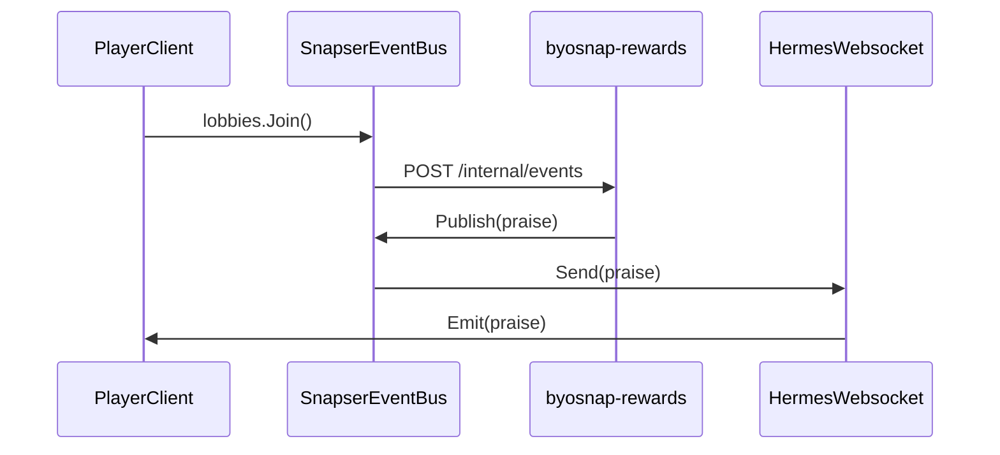

# BYOSnap Rewards

An example byosnap that congratulates a player when they join a lobby.

## Commands

Sync Snap

```bash
snapctl byosnap sync byosnap-rewards --path . --version v1.0.0 --snapend-id SNAPEND_ID
```

## How it works

### Setup
- `byosnap-rewards` registers a custom event with a subject of `praise`, which is translated to `snapser.byo.rewards.praise` by the EventBus.
- A webhook is setup to subscribe to `snapser.services.lobbies.joined` events.
- The hermes/websocket transport has the `snapser.byo.rewards.praise` toggled **on** 

### Flow

1. A player client makes an HTTP call to join a lobby which triggers an event of type `snapser.services.lobbies.joined`
2. `byosnap-rewards` receives this event on `/internal/events` and publishes a `praise` using Publish() on the EventBus.
3. Hermes/Websocket transport receives the `praise` event
4. If the player client is connected, it will receive the `praise` event and display a congratulatory message.
5. If the player client is not connected, the event will be dropped.

