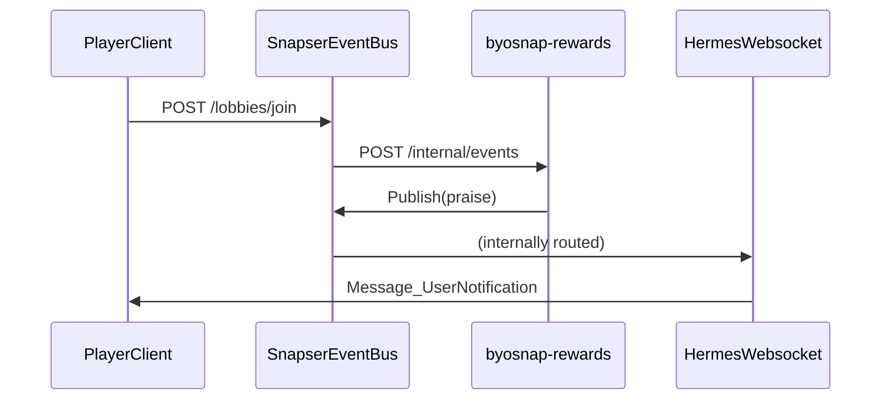

# BYOSnap Rewards

An example byosnap that congratulates a player when they join a lobby.

## How it works

### Configuration

*NOTE* EventBus >= 0.45.0 is required.

- `byosnap-rewards` registers a custom event with a subject of `praise`, which is translated to `snapser.byo.rewards.praise` by the EventBus.
- A webhook is setup to subscribe to `snapser.services.lobbies.joined` events.
- The hermes/websocket transport has the `snapser.byo.rewards.praise` toggled **on** 

### Example flow in this BYOSnap

