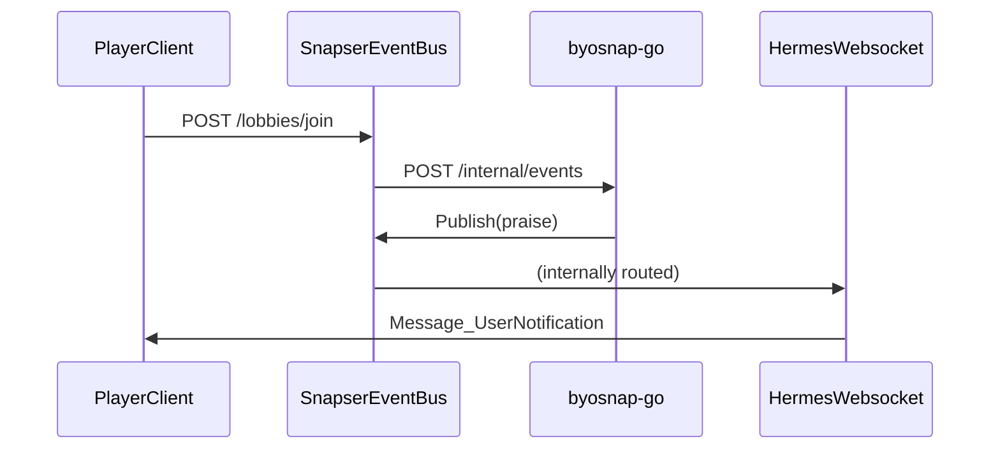

import { DocsButton } from '../../../../components/docs/DocsButton.tsx'

export const meta = {
  author: 'AJ Apte',
}

# Bring your own Snap - Realtime Events

BYOSnap is a Snapser feature that enables you to integrate your own custom code. BYOSnaps run in containers within Snapser's Kubernetes platform and can be written in any programming language to cater to your game's specific needs. Once deployed, a BYOSnap resides within the same Kubernetes cluster as your other Snaps, facilitating seamless integration with the broader Snapser ecosystem.

## Introduction
This guide will walk you through the process of integrating the BYOSnap with the Eventbus system. The Eventbus snap unlocks a highly scalable events system that allows you to send and receive events in real-time. This is particularly useful for games that require real-time updates, such as multiplayer games or games with live events.


<Warning>
The Eventbus Snap is a Premium Snap. You will not be able to go through this tutorial unless you are a Premium Tier customer.
</Warning>

## Step 0: Pre-requisites
Before you begin, ensure you have access to the Snapser CLI tool and you have gone through the BYOSnap Basic tutorial. This will help you understand the basic concepts of BYOSnap.


<div className="parent">
  <div className="tutorialBox">
    # Setup Snapser CLI

    You can go through the Setup Snapser CLI tutorial to install and configure Snapctl.

    <div>
      <DocsButton href={'/docs/guides/tutorials/setup-snapctl'} variant="contained" color="info" size="small" sx={{ml: 2, mb: 1}}>Tutorial</DocsButton>
    </div>
  </div>
  <div className="servicesBox">
    # BYOSnap Basic
    Please make sure you have a basic understanding of the BYOSnap concept and have gone through the BYOSnap Basic tutorial. Its not required for you to actually deploy the BYOSnap as we will be doing that in this tutorial. But it is highly recommended to go through the tutorial to understand the concepts.

    <div>
      <DocsButton href={'/docs/guides/tutorials/byosnap-basic'} variant="contained" color="info" size="small" sx={{ml: 2, mb: 1}}>Tutorial</DocsButton>
    </div>
  </div>
</div>

<Checkpoint step={0}>
  You are now ready to begin the tutorial.
</Checkpoint>

## Step 1: Create a Snapend
We start by creating a Snapend with the **Auth** and **Profile** Snaps. We are going to then download the **Internal SDK** and use it in our BYOSnap. This will allow us to communicate with the other Snaps in our Snapend.

### A. Create a Snapend
1. On your games home page click on the **+ Snapend** button.
   <Note>
    If you have not added a game yet, please add a game first and then go to the games home page.
   </Note>
1. Give your Snapend a name and click continue.
1. Select the **Auth**, **Lobbies**, **Eventbus** Snaps from the list of available Snaps and then click **Continue**.
    
1. In the Customization section, select **Gateway** from the navigation, scroll down and toggle *Web Sockets** to on and click **Save**.
    <Warning>
    Do not forget to click Save. Otherwise your Websocket will not be activated.
    </Warning>
    
1. Now, keep clicking **Continue** until you hit the review step. Confirm you see all the Snaps and the Web socket in the list and then click **Snap it!**.
1. A pop-up window will show the progress of creating your cluster. Your Snapend should be ready in a few moments.


## Step 2: Download the Protos

1. Go to the Snapend home page and in the left Navigation under tools click on **Downloads**.
1. Here you will see a widget called Protos. Select **Go** from the dropdown and then select **services** for `Protos Type` and click **Download**.
    
1. The downloaded protos will be in a zip file. Unzip the file and you will see a folder called **snapserpb** which has all the proto files with a folder structure like the following:
```bash
├── snapserpb/
│   └── auth_service_grpc.pb.go
│   └── auth_service.pb.go
│   └── auth_types.pb.go
│   └── eventbus_service_grpc.pb.go
│   └── eventbus_service.pb.go
│   └── eventbus_types.pb.go
│   └── google/
│   └── hermes_service_grpc.pb.go
│   └── hermes_service.pb.go
│   └── hermes_types.pb.go
│   └── lobbies_service_grpc.pb.go
│   └── lobbies_service.pb.go
│   └── lobbies_types.pb.go
│   └── protoc-gen-openapiv2/
│   └── validate/
```
<Warning>
  Snapser currently, gives you a flat set of protos, but you have to put them in folders so as to avoid any collisions.
</Warning>
1. Please update this folder in this format
```bash
├── snapserpb/ # 👈 This is the folder you will be copying to the root of your BYOSnap code
│   └── auth/
│       └── auth_service_grpc.pb.go
│       └── auth_service.pb.go
│       └── auth_types.pb.go
│   └── eventbus/
│       └── eventbus_service_grpc.pb.go
│       └── eventbus_service.pb.go
│       └── eventbus_types.pb.go
│   └── google/
│   └── hermes/
│       └── hermes_service_grpc.pb.go
│       └── hermes_service.pb.go
│       └── hermes_types.pb.go
│   └── lobbies/
│       └── lobbies_service_grpc.pb.go
│       └── lobbies_service.pb.go
│       └── lobbies_types.pb.go
│   └── protoc-gen-openapiv2/
│   └── validate/
```
<Note>
  Note all we have done is to create a folder for each service and move the proto files into the respective folders. This is important as we will be using these protos in our BYOSnap.
</Note>

<Checkpoint step={2}>
  You now have an proto files that you can integrate into your BYOSnap. Lets now proceed to integrate them into our BYOSnap
</Checkpoint>

## Step 3: Integrate the Protos
### A. Check out the example code
Here is the main [repo](https://github.com/snapser-community/snapser-byosnaps/tree/main/realtime-events) for the BYOSnap.
Snapser presently has an example in Go:
  - [Go](https://github.com/snapser-community/snapser-byosnaps/tree/main/realtime-events/byosnap-go)


```bash
# For HTTPS based cloning
git clone https://github.com/snapser-community/snapser-byosnaps.git
# For SSH based cloning
git@github.com:snapser-community/snapser-byosnaps.git
```

- In the repo, there is a folder called **realtime-events/**. Inside this folder, you will find the BYOSnap example code for go. The folder structure is as follows:
  ```bash
  ├── realtime-events/
  │   ├── byosnap-go/
  ```
  <Note>
  Each language folder contains a subfolder named **snapser-resources/**. Snapser utilizes this folder to access essential resources such as swagger.json, README.md, and BYOSnap profile files. To keep your root directory clean, these files are stored separately.
  </Note>

- Here is how the BYOSnap folder structure looks like:

  ```bash
  ├── realtime-events/
    │   ├── byosnap-go/
    │       └── snapser-resources/
    │           ├── README.md (👈 Powers the README of your BYOSNap on the Snapser Web portal )
    │           ├── snapser-base-snapend-manifest.json (👈 Automated Tutorial: Used by snapend_create.py )
    │           ├── snapser-byosnap-profile.json (👈 This powers the hardware and software settings for your BYOSnap )
    │           └── swagger.json (👈 This powers the SDK and API Explorer. Use the generate_swagger.* script to generate this file )
    │       └── snapserpb/ (👈 Replace contents of this file with the Protos you downloaded )
    │       └── Dockerfile (👈 Used by snapctl to deploy your BYOSnap )
    │       └── event_handler.go (👈 Code that handles incoming events )
    │       └── event_handler.go (👈 Register your event types )
    │       └── main.go (👈 Main entrypoint for your BYOSnap. This registers the custom event )
  ```

### B. Copy the Protos
Copy the contents of the **snapserpb/*** folder we made to the **snapserpb/** folder of your BYOSnap code directory. To ensure everything works, please compile your code.
```bash
go mod tidy
```
<Note>
  If this does not work, check if you have forgotten to put the proto files in the respective folders for the snaps.
</Note>

<Checkpoint step={3}>
  You have successfully copied the proto files to your BYOSnap code directory. Now we are ready to dive into the code.
</Checkpoint>

## Step 4: Understand the Code

Check out the code in **main.go**. Essentially we are doing three things in this tutorial:

### A. Register a custom event
This is so that our BYOSnap can emit an event that other BYOSnaps or game clients can listen for. As you can see in the code below, we are registering a custom event called **praise**. This is done by calling the **RegisterByoEventTypes** method on the Eventbus service.
```go
// A. Registering our own event "praise" with the Eventbus. This is so that our BYOSnap can
// emit custom events that our game clients or other BYOSnaps can listen for
//
// 👇 This is where we create a gRPC connection with the Eventbus and register our custom event
eventbusUrl := os.Getenv("SNAPEND_EVENTBUS_GRPC_URL")
if eventbusUrl == "" {
  log.Fatal().Msg("SNAPEND_EVENTBUS_GRPC_URL not set")
}
log.Info().Msgf("eventbus url: %s", eventbusUrl)

eventbusUrl = strings.TrimPrefix(eventbusUrl, "http://")

// Use grpc to call the eventbus service, RegisterEventTypes
conn, err := grpc.NewClient(eventbusUrl, grpc.WithTransportCredentials(insecure.NewCredentials()))
if err != nil {
  log.Error().Err(err).Msg("failed to create grpc client")
}
defer conn.Close()
eventbusClient := eventbuspb.NewEventbusServiceClient(conn)

app := &app{
  eventbusClient: eventbusClient,
}

// 👇 This is our custom event that we are registering
req := &eventbuspb.RegisterByoEventTypesRequest{
  ByosnapId:  byoSnapID,
  EventTypes: eventTypes,
}
md := metadata.Pairs("gateway", "internal")
ctx = metadata.NewOutgoingContext(ctx, md)
_, err = eventbusClient.RegisterByoEventTypes(ctx, req)
if err != nil {
  log.Fatal().Msgf("failed to register event types: %v", err)
}
log.Info().Msg("registered event types")
```

### B. Listen for Eventbus emitted Events
You can configure the Eventbus Snap to send specific events to your BYOSnap. The event is sent as a `webhook` on a reserver URL **POST /internal/events**.
```go
// B. We also want to listen for events from the Eventbus. Eventbus does this by sending
// a webhook to our BYOSnap on the reserved URL "POST /internal/events".
//
var router = gin.Default()
router.Use(logger.SetLogger())
router.Use(cors.New(cors.Config{
  AllowAllOrigins: true,
  AllowMethods:    []string{"GET", "POST", "PUT", "PATCH", "DELETE", "OPTIONS"},
  AllowHeaders:    []string{"Origin", "Authorization", "Content-Type", "User-Id", "Token", "App-Key"},
}))
router.GET("/healthz", func(c *gin.Context) {
  c.JSON(200, gin.H{"status": "ok"})
})
// 👇 This code is registering the webhook callback URL with the server
// any calls that come in call the eventHandler function for further processing
// IMPORTANT: Notice there is no BYOSnap prefix or byosnap ID in the URL.
router.POST("/internal/events", app.eventHandler)

if err = router.Run(":8080"); err != nil {
  log.Fatal().Err(err).Msg("failed to start server")
}
```

### C. Handle the Event and Emit an Event
The event handler is where we handle the incoming events from the Eventbus. We can then emit an event back to the Eventbus using the **PublishEvent** method. Check out the code below:
```go
func (a *app) eventHandler(c *gin.Context) {
	ctx := c.Request.Context()
	log := zerolog.Ctx(c.Request.Context())

	// Read the body in as a byte slice
	body, err := io.ReadAll(c.Request.Body)
	if err != nil {
		log.Fatal().Err(err).Msg("failed to read body")
	}

	// 👇 Parse body as eventbus.ByoWebhookMessage
	var wr eventbuspb.ByoWebhookRequest
	err = proto.Unmarshal(body, &wr)
	if err != nil {
		log.Fatal().Str("requestBody", string(body)).Err(err).Msg("failed to unmarshal body")
	}

	// Switch on the message type
	// NOTE: Currently the only type we handle is snap events
	switch wr.MessageType {
	case eventbuspb.MessageType_MESSAGE_TYPE_SNAP_EVENT:
		snapEvent := wr.GetByoSnapEvent()
		log.Debug().Interface("snapEvent", snapEvent).Msg("received snap event")

		// Switch on the subject which is the recommended way to identify the event and payload
		switch snapEvent.Subject {
		//👇 For this tutorial we are going to listen on a Lobby member joined event
		case "snapser.services.lobbies.member.joined":
			ev := &lobbiespb.EventLobbiesMemberJoined{}
			if err := proto.Unmarshal([]byte(snapEvent.Payload), ev); err != nil {
				panic(err)
			}
			log.Info().Msgf("got EventLobbiesMemberJoined: %v", ev)

			// Some praise messages
			var fallbackPraises = []string{
				"You're doing amazing work!",
				"Keep up the fantastic effort!",
				"Your dedication is inspiring!",
				"You're a star, keep shining!",
				"You have the power to achieve great things!",
				"Believe in yourself, you're unstoppable!",
			}

			randomPraise := fallbackPraises[rand.Intn(len(fallbackPraises))]
			//👇 After, getting this event we are going to emit the custom Praise event we registered
			praiseReq := &eventbuspb.PublishByoEventRequest{
				ByosnapId:  byoSnapID,
				Subject:    "praise",
				Payload:    []byte(fmt.Sprintf("Nice work, you joined a lobby - %s", randomPraise)),
				Recipients: []string{ev.JoinedUserId},
			}
			ctx = metadata.NewOutgoingContext(ctx, metadata.Pairs("gateway", "internal"))
			_, err := a.eventbusClient.PublishByoEvent(ctx, praiseReq)
			if err != nil {
				log.Error().Err(err).Msg("failed to publish event")
			} else {
				log.Info().Msgf("published praise event: %v", praiseReq)
			}
		default:
			log.Warn().Msgf("unhandled event: [eventTypeId=%d, subject=%s, serviceName=%s]",
				snapEvent.EventTypeId, snapEvent.Subject, snapEvent.ServiceName)
		}
	default:
		log.Printf("unhandled message type: %v", wr.MessageType)
	}

	c.Writer.WriteHeader(http.StatusOK)
	c.Writer.Write([]byte("ok"))
}
```

<Checkpoint step={4}>
  You now have code that registers for a custom event, listens for events from the Eventbus and emits an event back to the Eventbus. Lets deploy our BYOSnap and then put all of this to a test.
</Checkpoint>

## Step 5: Deploy the BYOSnap

Now, lets deploy our BYOSnap to the Private Snaps dashboard on Snapser.

- For this tutorial, let's select $byosnapId=**byosnap-go**.
- Select a version number. Set $version to `v1.0.0`.
- Determine the full path to the root of your code directory, e.g., `/Users/aj/snapser-byosnaps/realtime-events/byosnap-go`.
- Identify the resources folder, which is the `snapser-resources` folder at the root of your code directory.

Replace the variables below with your custom values and execute the command to deploy your BYOSnap.


<CodeGroup title="Deploy BYOSnap" tag="bash" >
```bash
# $byosnapId = BYOSnap Id. Should start with `byosnap-`. Should not contain spaces and should only contain characters.
# $version = Version number for your BYOSnap. Should be in the format v1.0.0
# $path = Path to the directory where your BYOSnap code resides.
# $tag = Tag for your BYOSnap. This is optional.
snapctl byosnap publish --byosnap-id $byosnapId --version $version --path $rootCodePath --resources-path $rootCodePath/snapser-resources
```
</CodeGroup>

You will see the output from the Snapctl tool as it deploys your BYOSnap to Snapser. Once the deployment is
complete, you will see a success message.
```bash
Success BYOSnap upload successful
Success Uploaded swagger.json
Success Uploaded README.md
Success Completed the docs uploading process
Success BYOSNAP publish successful
Success BYOSNAP publish version successful
Success BYOSNAP published successfully
BYOSnap published successfully with version v1.0.0
```
<Note>
  The Snapshots below assume you are using the C# codebase. But the steps are the same for all languages.
</Note>

- Once you publish you will be able to see your BYOSnap in the **Custom Snaps** tool.


<Note>
  The publish command makes your BYOSnap available to other developers in your organization. You must increment the version number with each subsequent publish.
</Note>

<Checkpoint step={5}>
  Now that our BYOSnap is published, we are ready to add it to our Snapend.
</Checkpoint>

## Step 6: Add BYOSnap to Snapend
Now that we have published a BYOSnap, let's integrate it into a Snapend.

1. Go to the Snapser Web App and click on the Snapend you created in the **Snapend Creation** tutorial.
1. On your Snapend homepage, click the **Edit** button. This will take you to the Snapend Edit page.

1. Here, you will find the Snaps already included in your Snapend. Scroll down to locate the BYOSnap you just published and click the **Add** button.
    
    <Note>
      Use the filter widget at the top right to display only BYOSnaps.
    </Note>
1. Continue clicking **Continue** until you reach the final **Review** step, then click the **Snap it** button.
1. A pop-up window will show the progress of creating your cluster. Your updated Snapend should be ready in a few moments.

<Checkpoint step={6}>
  You now have a Snapend with the BYOSnap integrated. We are now to configure the Snapend and then test our implementation.
</Checkpoint>

## Step 7. Configure your Snaps
1. Once your Snapend is ready, click on the **Configuration Tool** button on the Snapend home page.
1. This will take you to the Configuration tool page where we want to configure the **Auth** and the **Eventbus** Snaps.

### A. Auth Snap
1. First, lets click on the **Auth** Snap from the navigation bar on the left and select the **Connectors** tool.
1. Here we want to enable the **Anonymous Auth**. Click on Add Connectors and select Anonymous. Click Save on the form to enable the connector.
    

### B. Eventbus Snap
1. Now, click on the Back button to go back to the Configuration tool home page. Now click on the **Eventbus** Snap from the navigation bar on the left.
    
1. Here we want to toggle two events:
    - Lobbies - A member joined a lobby
    - Byosnap-go - Praise the user for doing something
    <Note>
      The Byosnap-go event is the custom event we registered in the code. You can see the event in the list of events.
    </Note>
    
    
1. Now, click on the **Webhook** navigation item on the left and then click on the **Add Webhook** button.
    - First select the **Byosnap-go** event from the dropdown.
    - Then under the Events section select **Snapser.services.lobbies.member.joined** event.
    - Click **Save** to save the webhook.
    

<Note>
  **IMPORTANT**: With this setup, we have told the Eventbus snap that we would like to enable the registered event for our BYOSnap and the Lobbies member joined event. Eventbus snap does not just enable all events by default. You have to explicitly tell the Eventbus snap which events you want to enable.

  Next, we told the snap that we would like to receive the event when a member joins a lobby.
</Note>

<Checkpoint step={7}>
  With the setup complete, finally, its time for us to test our implementation. We are going to use the API Explorer and the Steam tool to test this.
</Checkpoint>

## Step 8: Test the implementation
For testing this, we are going to
1. Create two Anonymous users. User A and User B.
1. User A who is the owner will then create a Lobby.
1. User B will connect to the event stream to listen for events.
1. User B will join the lobby.
1. User B will receive the custom praise event from the BYOSnap.


Navigate to the Snapend home dashboard and click on the **API Explorer** button under **Quick Links** to access the tool where you can test your API endpoints.

### A. Create a Anonymous Users
1. Click on the **Auth** Snap.
    
1. Select the **Anonymous Login > AnonLogin PUT** API.
1. In the payload section, update the **user_name** to any name you prefer and click on the **PUT** button.
    
1. You will receive a successful response with a **user_id** and **session_token**. This is your User A's User ID and the JWT token for the session.
    
1. Repeat the above steps to create a second Anonymous user. This will be User B. You should use a different name.
<Note>
  Please save the $userId and $sessionToken for both users, as you will need them for subsequent steps.
  You can also click the **API Recorder** button at the top of the API Explorer to view and copy the user ID and session token for future use.
</Note>


### B. Create a Lobby
1. Go back to the main API Explorer home page and click on the **Lobbies** Snap.
1. Select the **Create Lobby > CreateLobby POST** API.
1. Now add the user token for `User A` to the **Token** header of the **CreateLobby** API section, paste the payload you see below and click **POST**.
```json
{
  "allow_party_join": true,
  "description": "We will use this lobby to test",
  "max_members": 2,
  "name": "BYOSnap event test",
  "owner_metadata": {},
  "owner_placement": 0,
  "private": false,
  "search_metadata": {},
  "start_after_seconds": 0
}
```
You should see a successful response with the lobby ID and other details. **IMPORTANT**: Save the **Lobby ID** as you will need it for the next step.


### C. View the Event Stream & Join the Lobby
#### Open Stream Tool
1. Now, before we get User B to join the lobby, we need to start the Steam tool. This will allow us to see the events that are being emitted by the Eventbus snap for User B.
    <Note>
    Remember, when User B joins the lobby, the eventbus Snap is going to send a webhook to the BYOSnap. The BYOSnap is then going to emit a praise event to be received by the user who joined the Lobby, in our case its User B.
    </Note>
1. Click on the Join Lobby API first to render the view.
1. Click on the **Steam** tool icon to see the steam tool. Copy the users **session_token** for User B and click Connect.
    
    <Note>
      You should see a message like **Websocket connection opened**. If not, you may have forgotten to enable Websockets during Snapend creation or you may have put an incorrect session token.
    </Note>
#### User B joins the Lobby
1. Now, in the API explorer:
    - Add the **Lobby Id** of the Lobby that User A created, in the URL parameter `lobby_id`.
    - Add the **session_token** for User B to the **Token** header of the **JoinLobby** API section.
    - Enter the User B's user Id in the payload. Here is an example of the payload `{"metadata": {},"placement": 0,"user_id": "e839c411-7891-45e0-be05-e1b96b86ebec"}`
    - Finally, click **POST**.
    - You should see a successful response with the lobby ID and see that the User B got notfied of the praise event in near real-time. You can see the event come in the stream tool.
    

<Checkpoint step={8}>
  Congratulations! You have successfully completed the tutorial. You now know how your BYOSnaps can register custom events, listen for events from the Eventbus and emit events back to the Eventbus.
</Checkpoint>

### Overall Event Flow


