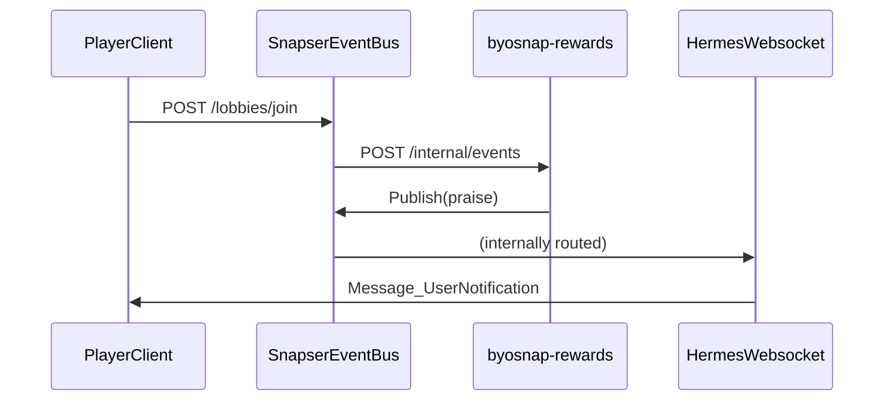

# BYOSnap Rewards
IMPORTANT: This folder is still WIP. This BYOSnap depends on functionality that is going live with
beta-0.45.0 which goes out January 27, 2024. After this date this folder will be cleaned up.

An example byosnap that congratulates a player when they join a lobby.

## How it works

- `byosnap-rewards` registers a custom event with a subject of `praise`, which is translated to `snapser.byo.byosnap-rewards.praise` by the EventBus.
- A webhook is setup to subscribe to `snapser.services.lobbies.joined` events
- The hermes/websocket transport has the `snapser.byo.byosnap-rewards.praise` toggled **on**

Now when a player joins a lobby, `byosnap-rewards` will receive that event and publish a `praise` event with
the subject `snapser.byo.byosnap-rewards.praise`. The payload is a string as bytes.

In your WebSocket client code you can switch on `Message_SnapEvent.Subject` for `snapser.byo.byosnap-rewards.praise` and decode the payload which is just a string as bytes and display it to the user.

## Snapend Setup

### Using `snapctl` and `clone`

In the `byosnap-rewards` directory run:

```shell
snapctl snapend clone --manifest-path=manifest.json --game-id=$game_id --name=fromcli --env=DEVELOPMENT
```

### Mnauallly in an existing or new Snapend

*NOTE* EventBus >= 0.45.0 is required.

**Required Snaps**: Rewards (This BYOSnap), Lobbies, Auth, EventBus and enable the WebSocket Gateway.

1. Publish this BYOSnap to your Snapend with:
    ```shell
    snapctl byosnap publish --byosnap-id byosnap-rewards --version v1.0.0 --path .
    ```
1. Add `byosnap-rewards` to an existing Snapend, or create a new Snapend with the `byosnap-rewards` BYOSnap and required Snaps above.
2. In the EventBus configuration for Websocket toggle on these two events: `snapser.services.lobbies.member.joined` and `snapser.byo.byosnap-rewards.praise events`
3. Add a Webhook configuration for byosnap-rewards and select `snapser.services.lobbies.member.joined` and `snapser.byo.byosnap-rewards.praise` events

### Overall Event Flow


